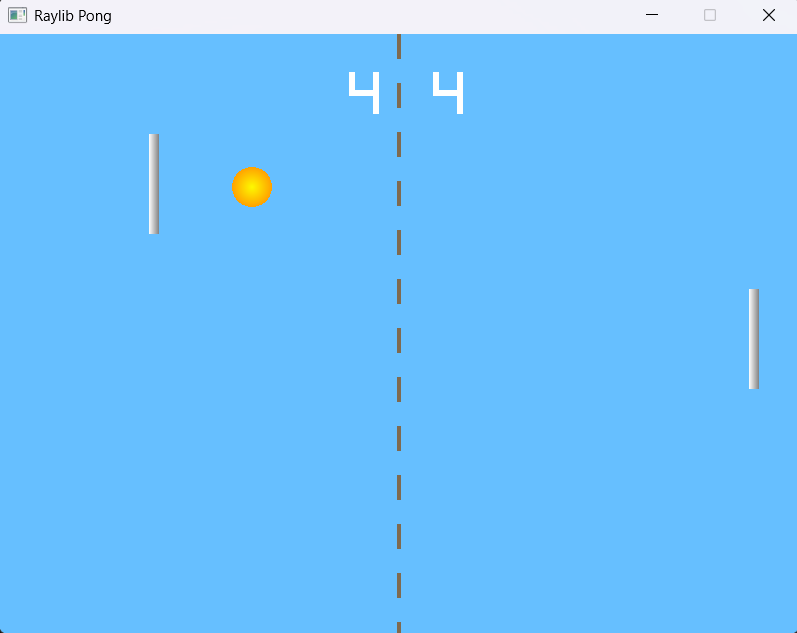
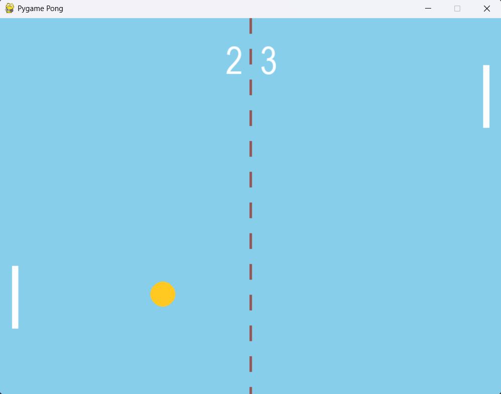

# Pong

## What is this?

A pong clone.

## Who made this game?

Me 90% with some help from my dad 10%.

## Why did I make it?

A exercise in modular programming. There are 3 modules and the logic module is imported into the 2 Gui moudules.

## How to play?

There are 2 Guis you can use but the game is the same. 

- ray_pong.py - raylib/pyray - game engine
- pygame_pong.py - pygame - game engine

### Controls

- WASD - P1 
- Arrow Keys - P2 

You can move in all 4 directions!!!

## Screenshots

